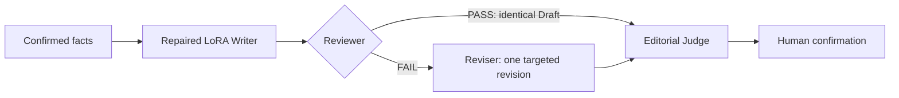
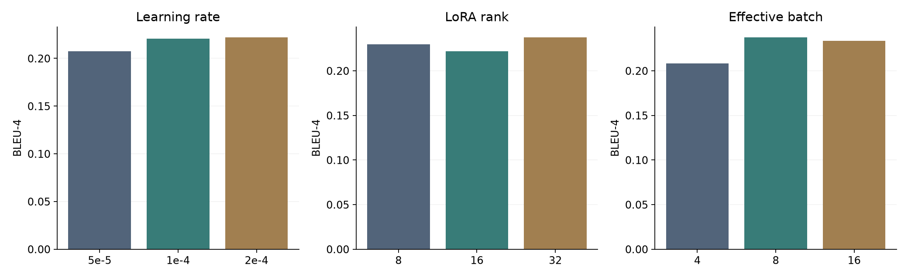
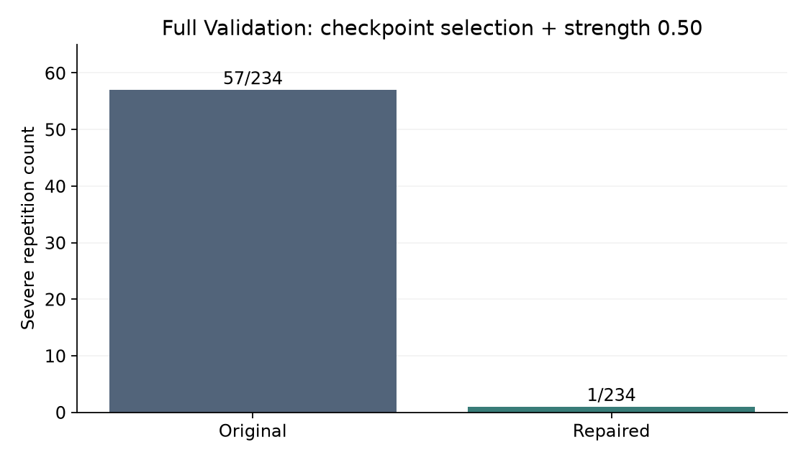
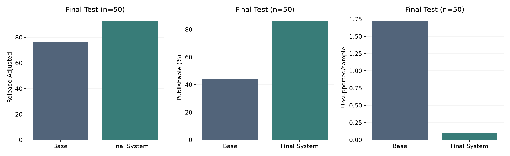
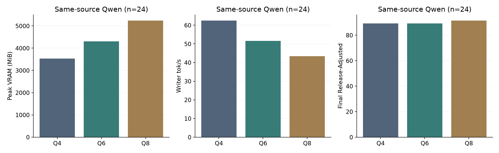
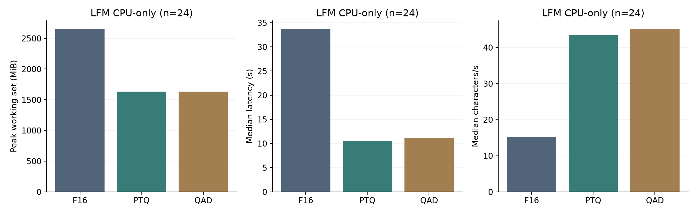
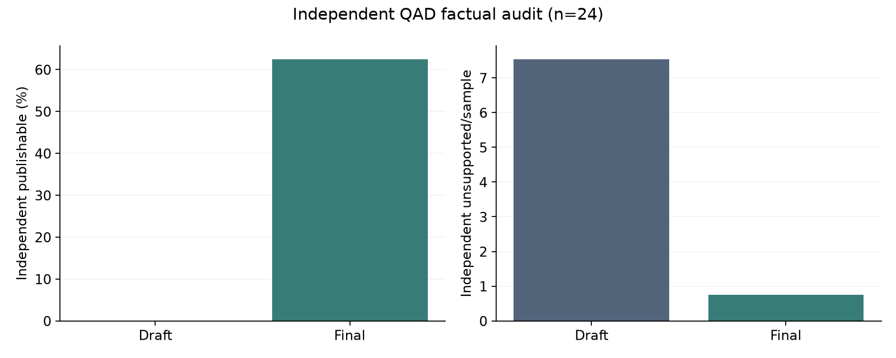

# Domain-Specific News Generation with LoRA and Review–Revision Agents

Qwen3-4B + LoRA style adaptation, generation stability repair, fact-grounded review
and revision, and lightweight deployment studies. This project was developed during
an industry internship focused on domain-specific corporate news generation.
This repository is a personal technical portfolio, with no company endorsement.

## Key Contributions

- A 2,338-sample SFT data pipeline with source/event split isolation and fact evidence.
- Controlled learning-rate, rank and effective-batch LoRA experiments.
- Diagnosis of free-generation repetition despite improving teacher-forcing loss.
- Earlier checkpoint selection and adapter scaling to repair generation stability.
- Writer / Reviewer / Reviser / Editorial Judge workflow with a conditional PASS path.
- Release-aware evaluation alongside ordinary text-overlap and editorial metrics.
- Same-source Qwen Q4/Q6/Q8 GPU deployment and LFM2.5 F16/PTQ/QAD CPU experiments.
- Independent factual audit of the QAD closed loop.

## System Architecture



Reviewer PASS skips Reviser; it does not mean automatic publication.

## Dataset

Full dataset is not included. Train / Validation / Test = **1,871 / 234 / 233**;
total **2,338** samples and **18,437** facts. Gold 239 + accepted Silver 2,099.
Public files contain only invented examples, schema explanations and aggregate results.
See [data policy and schema](data/README.md).

## LoRA Experiments

| Experiment | Values | Controlled settings | Selected |
|---|---|---|---|
| Learning rate | 5e-5, 1e-4, 2e-4 | rank 16, effective batch 8 | 2e-4 |
| Rank | 8, 16, 32 | LR 2e-4, effective batch 8 | 32 |
| Effective batch | 4, 8, 16 | LR 2e-4, rank 32 | 8 |

Base: Qwen3-4B-Instruct-2507. Fixed alpha=32, dropout=.05, epochs=3, seed=42.
The LR table describes the study selection; it is not a claim that every overlap
metric peaks at the selected value. [LR](results/lora/lr.csv),
[rank](results/lora/rank.csv), [batch](results/lora/batch.csv) include loss and BLEU/ROUGE.
Formal runtime configurations are in [configs/reproduction](configs/reproduction).



## Generation Stability

Severe repetition on full Validation fell from **57/234 to 1/234**.
The repaired Writer uses **checkpoint-117**, effective adapter strength **0.50**.
The original training ran through multiple checkpoints; checkpoint-117 was selected
retrospectively using free-generation stability. The original run was not defined
as training only to 0.5 epoch. Teacher-forcing Eval Loss and free-generation stability
can diverge. [Cohort-labelled counts](results/stability/summary.json).



## Review–Revision System

Reviewer checks fact grounding, retained information, title, formality, structure and
repetition. Reviser makes targeted edits without adding facts. Schema validation,
one schema retry, safe errors and unchanged PASS output are explicit in the code.
[Agents](demo/agents.py) · [workflow](demo/workflow.py) · [methodology](docs/methodology.md).

## Evaluation

Raw Editorial Score sums six dimensions to 100. Release-Adjusted caps risky drafts
and subtracts unsupported-claim penalties. **Release-Adjusted is an internal engineering
metric, not an industry standard.** [Exact formula and limitations](docs/evaluation.md).

## Final Results

Frozen Final Test, n=50; descriptive observed improvements in this evaluation.

| System | Raw Editorial | Release-Adjusted | Publishable | Unsupported/sample |
|---|---:|---:|---:|---:|
| Base | 93.140 | 76.360 | 44.0% | 1.720 |
| Final System | 96.140 | 92.620 | 86.0% | 0.100 |

[Aggregate source](results/final_system/final_test.csv).



## Lightweight Deployment

**Route A — Qwen + Repaired LoRA, same-source Q4/Q6/Q8, n=24.**

| Precision | Base GiB | Peak GPU MiB | Writer tok/s | Writer latency s | Final Release-Adjusted | Final publishable |
|---|---:|---:|---:|---:|---:|---:|
| Q4 | 2.326 | 3535 | 62.43 | 5.74 | 89.208 | 75.0% |
| Q6 | 3.079 | 4305 | 51.64 | 7.17 | 89.208 | 70.8% |
| Q8 | 3.986 | 5235 | 43.38 | 8.22 | 91.375 | 79.2% |

No unique system sweet spot was established. Draft/Final quality, agent burden and
size/latency/throughput are retained in [aggregate tables](results/lightweight).
Base GiB excludes the adapter. Do not compare these GPU token rates directly to LFM
CPU character rates.



**Route B — LFM2.5 F16/PTQ/QAD, CPU-only, n=24.**
Public aggregates cover runtime, BLEU/ROUGE, editorial and release metrics.
The original QAD Final Judge rated publishability at 100%; the independent factual
audit rated it **62.5% (15/24)** and found **0.750 unsupported claims/sample**.
This disagreement is a material limitation, not evidence of guaranteed factuality.
See [independent aggregate](results/lightweight/lfm_independent_audit.json).




## Setup

Python 3.11+; use a fresh virtual environment.

```bash
python -m venv .venv
# Activate .venv for your shell, then:
python -m pip install -r requirements.txt
python -m pytest -q -p no:cacheprovider
python -m demo.app
```

## Demo

The default **Synthetic offline** mode requires no API key or model. It exercises the
original workflow using explicitly scripted fictional responses and scores. Select
PASS to inspect the branch that bypasses Reviser. [Demo setup](demo/README.md).
Optional online mode requires your own permitted services configured locally from
[the empty environment example](demo/.env.example).

## Repository Structure

- `src/`, `scripts/`: selected original data, training, inference and evaluation source.
- `configs/`: original guarded protocol plus formal runtime YAMLs and repaired settings.
- `demo/`: public Gradio workflow, agents, schemas, parser, scoring and synthetic loader.
- `data/samples/`: entirely fictional fixtures.
- `experiments/`: source maps and selected historical lightweight runners.
- `results/`: small aggregate-only CSV/JSON results.
- `docs/`: methods, evaluation, model notes, provenance, validation and six neutral figures.

## Reproduction Notes

`python scripts/plot_public_results.py` redraws all figures from the included aggregates;
it does not execute model experiments. `python scripts/validate_release.py` reruns
structural and publication checks. [Model and training notes](docs/model_download.md)
distinguish portable smoke execution from historical full experiments requiring
excluded private artifacts. [Source provenance](docs/source_manifest.json) records
original file hashes; rebased file references denote provenance, not bundled raw evidence.

## Limitations

- Dataset is not publicly redistributed; model weights are not included in the public repository.
- Single-seed engineering study; no statistical significance claim.
- LLM-as-a-Judge has factual, calibration and self-evaluation limitations.
- Independent audit was used for the QAD closed loop and found remaining factual risks.
- Full historical training/inference cannot be reproduced using only the public files.
- Hardware, runtime and hosted-service versions affect deployment measurements.

## Acknowledgements / Models

[Qwen](https://github.com/QwenLM/Qwen3),
[LLaMA-Factory](https://github.com/hiyouga/LLaMA-Factory),
[llama.cpp](https://github.com/ggml-org/llama.cpp),
[Liquid AI / LFM](https://huggingface.co/LiquidAI).
Model licenses remain separate from this project's code publication decision.
No open-source license is currently assigned.
